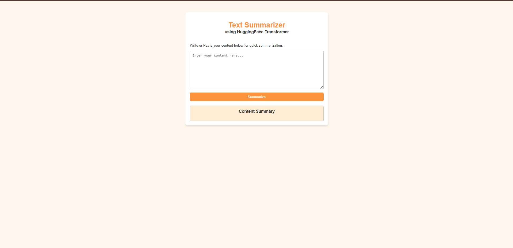

# 📝 Text Summarizer using T5 Transformer

A web application for abstractive text summarization built with **FastAPI** and a **fine-tuned T5 Transformer** from Hugging Face. Users can paste text into a simple web interface and receive an AI-generated summary.

---

## ✨ Features

- 🤖 Fine-tuned T5 Transformer model
- ⚡ FastAPI backend
- 🌐 Interactive HTML/CSS/JavaScript frontend
- 📝 Abstractive text summarization
- ☁️ Model hosted on Hugging Face
- 🔥 REST API for programmatic access

---

## 🛠️ Tech Stack

- Python 3.11
- FastAPI
- Hugging Face Transformers
- PyTorch
- Jinja2
- HTML5
- CSS3
- JavaScript

---

## 📂 Project Structure

```text
TEXTSUMMARIZERAPP/
│
├── app.py
├── requirements.txt
├── README.md
├── .gitignore
│
├── templates/
│   └── index.html
│
└── screenshots/
    └── app_demo.png
```

---

## 📦 Installation

### 1. Clone the repository

```bash
git clone https://github.com/Kushagra25-hub/text-summarizer.git

cd text-summarizer
```

### 2. Create a virtual environment (optional but recommended)

#### Windows

```bash
python -m venv venv

venv\Scripts\activate
```

#### Linux / macOS

```bash
python3 -m venv venv

source venv/bin/activate
```

### 3. Install dependencies

```bash
pip install -r requirements.txt
```

---

## ▶️ Run the Application

```bash
uvicorn app:app --reload
```

Open your browser and visit:

```
http://127.0.0.1:8000
```

---

## 🤗 Model

The fine-tuned T5 model is hosted on Hugging Face.

**Model Repository:**

https://huggingface.co/kushagra2511/text-summarizer-t5

The application automatically downloads the model during the first run.

---

## 📡 API Endpoint

### POST `/summarize/`

#### Request

```json
{
  "dialogue": "Your input text here..."
}
```

#### Response

```json
{
  "summary": "Generated summary..."
}
```

---

## 📸 Application Preview

| Home Page |
|-----------|
|  |

---

## 🔮 Future Improvements

- Upload PDF and DOCX files
- Adjustable summary length
- Docker support
- Cloud deployment (Render, Railway, AWS)
- User authentication
- Dark mode

---

## 👨‍💻 Author

**Kushagra**

GitHub: https://github.com/Kushagra25-hub

LinkedIn: https://linkedin.com/in/kushagrasri25

---

## ⭐ If you found this project useful

Please consider giving the repository a ⭐.
